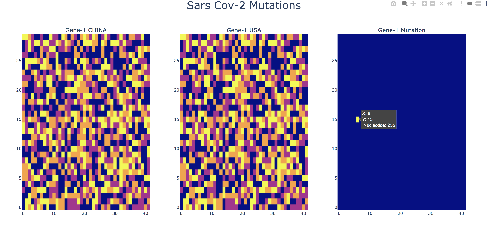
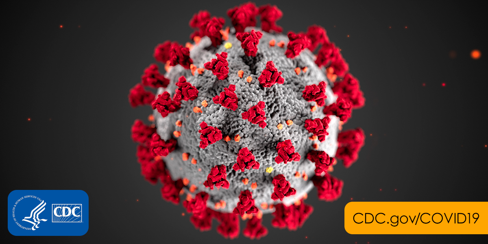

# Python-Sars Cov-2 Mutation Analysis

This is a repo created for analyzing mutations on the nucleotides of various genes of Sars Cov-2.
Two different Nucleotide sequences of Sars Cov-2 are read from the NCBI gene bank. It is then conveted into Numpy arrrays. The data read into numpy array is then analyzed and compared. Each gene from 2 diffeent sequence can be compared against each other. By doing this kind of a data analysis we can find the mutations associated with each gene. This would help the vaccine/drug develelopment efforts to focus on those gene expression that has the least mutation.

## Sars Cov -2 Virus genome is sequenced to have the following genes.

1. gene=ORF1ab.  --> Open Reading Frame 1 which encodes for the proteins ORF1a and ORF1ab
2. gene=S        --> This gene encodes Spike Protein which docks with the ACE2 receptors of the human cell before endocytosis.
3. gene=ORF3a    --> Open Reading Frame 3 which encodes for ORF3a protein.
4. gene=E        --> This gene encodes for the Envelope protein.
5. gene=M        --> This gene encodes for the Membrane protein.
6. gene=ORF6     --> Open Reading Frame 6 which encodes for ORF6 protein.
7. gene=ORF7a    --> Open Reading Frame 7a which encodes for ORF7a protein.
8. gene=ORF7b    --> Open Reading Frame 7b which encodes for ORF7b protein.
9. gene=ORF8     --> Open Reading Frame 8 which encodes for ORF8 protein.
10. gene=N        --> This gene encodes for the Nucleocapsid phosphoprotein.
11. gene=ORF10    --> Open Reading Frame 10 which encodes for ORF10 protein.

## How to Run the Code:

Get dna.py,Main_Final.py,scov.py,helper.py python scripts and place them in a directory. Download the 2 different Sars Cov-2 nucleotide sequences from NCBI website. In the python script Main_Final.py at line 9 and 14 respectively specify file-1 and file-2 nucleotide sequence downloaded fron NCBI. Run the script Main_Final.py file and wait for the output file Sars_Cov-2_Gene_Mutation.jpg under the same directory. The python shell would also print out the mutated nucleotides for each gene as below.

##### Example Shell Output
* Mutated DNA Base 100 in China and Base 255 in USA at position (74, 6) For the Gene ORF1ab
* Mutated DNA Base 255 in China and Base 100 in USA at position (12, 10) For the Gene ORF8
* Mutated DNA Base 0 in China and Base 255 in USA at position (17, 24) For the Gene N

## What are supplied in the repo.

- dna.py --> Python DNA class file. 
- Main_Final.py --> The driver python script.
- scov.py --> Important python dictionaries are pre-defined in this script.
- helper.py --> Has python helper function to read and format the nucleotide sequence files previously downloaded from NCBI.
- China_Seq_2019_Dec.txt --> Sars Cov-2 nucleotide sequence in China downloaded from NCBI.
- USA_Seq_2020_Jan.txt --> Sars Cov-2 nucleotide sequence in China downloaded from NCBI.
- Sars_Cov-2_Gene_Mutation.jpg --> Output produced from running the python code specified above.
